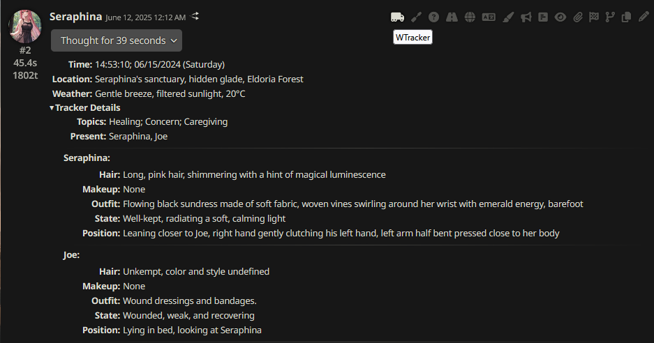

# SillyTavern WTracker

## Overview

A [SillyTavern](https://docs.sillytavern.app/) extension that helps you track your chat stats with LLMs using [connection profiles](https://docs.sillytavern.app/usage/core-concepts/connection-profiles/).



---

## Installation

Install via the SillyTavern extension installer:

```txt
https://github.com/mjnitz02/SillyTavern-WTrackerLite
```

## FAQ

>I'm having API error.

Your API/model might not support structured output. Change `Prompt Engineering` mode from `Native API` to `JSON` or `XML`.

> What is the difference compared to [famous tracker](https://github.com/kaldigo/SillyTavern-Tracker)?

Most importantly, it works. This is a minimalistic version of the original tracker.
- No annoying connection profile switch. (This is the reason why I created this extension in the first place.)
- No "Prompt Maker" option. Because JSON schema is easy enough to edit.
- No "Generation Target" option. (Could be added in the future)
- No "Generation Mode" option. Since this extension doesn't summarize the chat, no need for it. (I'm not planning to add a summarize feature.)
- There are some templates in the original, but I don't need them since I don't have those features.


> What is the difference compared to [famous tracker](https://github.com/bmen25124/SillyTavern-WTracker)?
- Uses `ConnectionManagerRequestService` instead of legacy connection profiles.
- JSON by default, removed the XML and Naive modes.
- Streamlined generation prompts, templates and settings menus.
- Uses a modified injection format, more conducive to modern LLMs.
- Updated css to be compatible with Moonlight Echoes.
- Simple toast indicators to know when tracker is doing something.